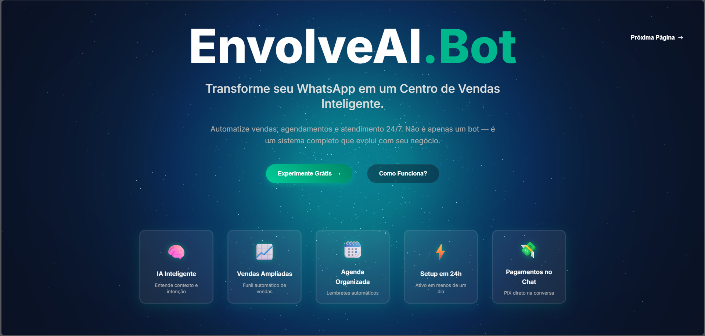

Projeto de site para EnvolveAI.Bot

Landing page do EnvolveAI.Bot - site de uma Saas, que cria automações para WhatsApp empresarial para: autônomos, quenas, e medias empresas. Com experiência visual 3D, WebGL, GSAP,  foco em conversão e simulações interativas no WhatsApp.

 Estrutura
- index.html
- assets/css/styles.css
- assets/js/script.js
- assets/js/fix-overlay.js
- assets/js/cards-interaction.js
- assets/js/scroll-3d-integration.js
- assets/img/Capa.png
- api-proxy/

 Como executar
- Abra o index.html no navegador
- Ou use: npm install && npm run start

 Build
- npm run build

 Tecnologias
- HTML, CSS, JavaScript
- Three.js, GSAP, Font Awesome
